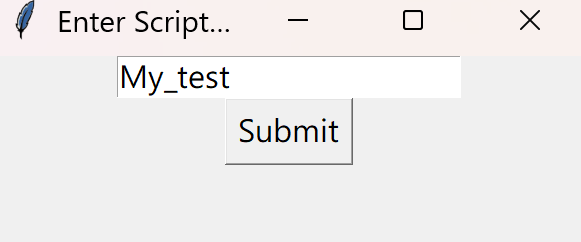
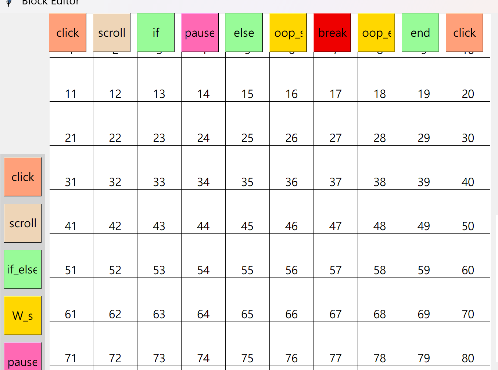
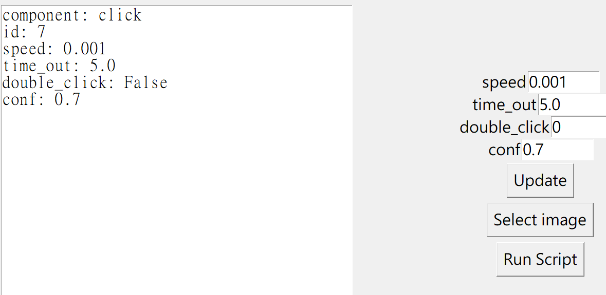
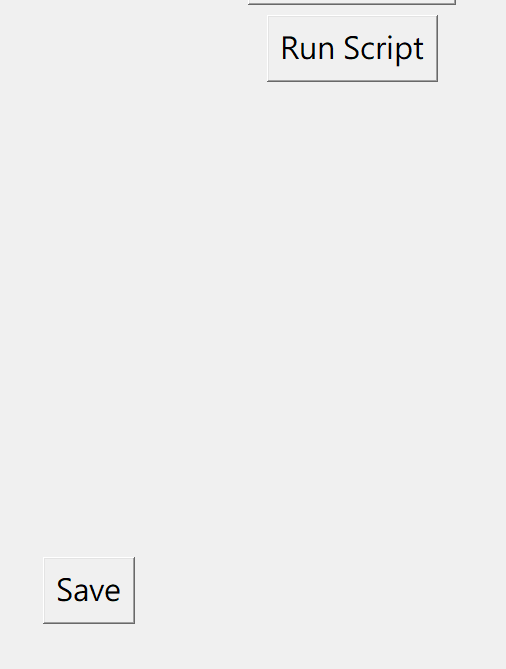
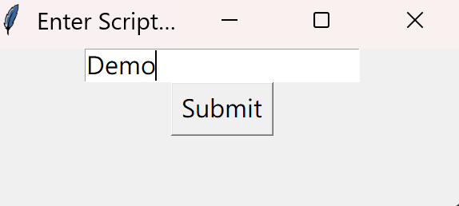

# AutoClicker
## Introduction
A simple compiler built with PyAutoGUI that lets you build program that controls mouse movement and keyboard functions.\
An scratch like editor is provided for programming button logic sequence.
## Environment setup
```bash
// Create environmnet
conda create -n auto_clicker python=3.10
conda activate auto_clicker
pip install -r requirements.txt
```

## Launching the program
```bash
// Activate Environment
conda activate auto_clicker
// Launch the GUI
cd Cropping_component
python real_time_complier.py
```
## Usage
### 1. Enter the script name you want to alter or execute, and press submit.


### 2. Add component by clicking on the element on the sidebar.


### 3. Edit the components' attributes by clicking on the elements and hitting update.


### 4. Delete the components by dragging them into the red bounding box.


### 5. Save the script and click 'Run Script' to start execution.


## Script example
I provide a simple demo script that search for Youtube icon on screen and attempts to click it five times in a row.
```bash
// Activate Environment
conda activate auto_clicker
// Launch the GUI
cd Cropping_component
python real_time_complier.py
```
### 1. Enter 'Demo'


### 2. Click 'Run Script'


## Advance features
### Since the script is saved in human-readable list format, it is possible to use AI to generate scripts automatically, though manual labor may still be required to select the images.
